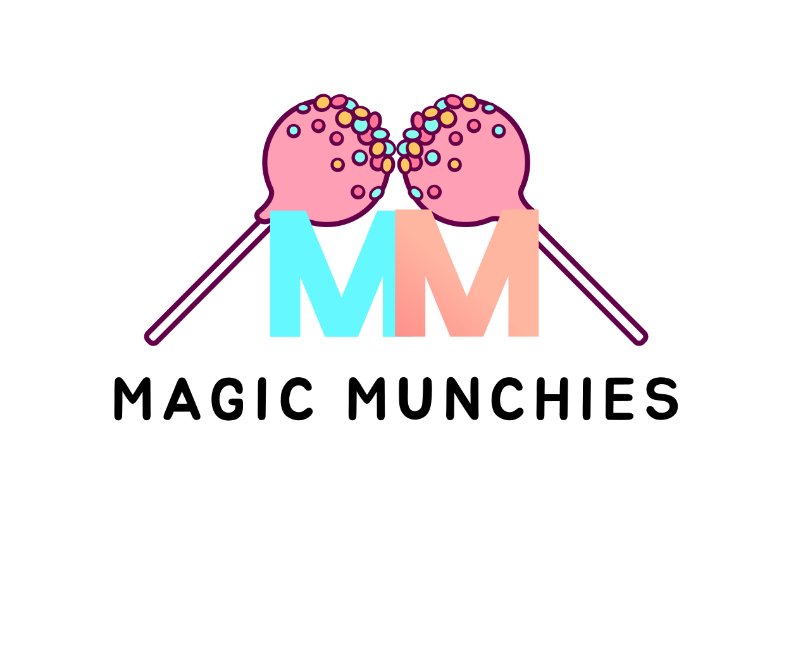

# Magic Munchies 🍪🎂

Welcome to **Magic Munchies** – a delightful treat site for a local business in Texas! Built with the latest web technologies, Magic Munchies offers a fast, modern, and visually appealing experience to make browsing delicious treats fun and easy.

## 🚀 Tech Stack

- **⚡ React & Vite** – Lightning-fast development and performance
- **🎨 Tailwind CSS** – Elegant and responsive styling
- **📱 Fully Responsive** – Optimized for all devices

## ✨ Features

- **Dynamic Carousel** – Showcasing mouthwatering treats with smooth transitions
- **Modern UI/UX** – A seamless and intuitive browsing experience
- **Optimized Performance** – Fast load times and efficient rendering
- **Mobile Friendly** – Works beautifully on all screen sizes
- **Scalable & Maintainable** – Built with best practices for future growth

## 📸 Preview

## 🎯 Roadmap
- [ ] Add online ordering functionality
- [ ] Implement user authentication
- [ ] Introduce a blog section for baking tips
- [ ] Enhance animations and interactivity

## ❤️ Support & Contributions
We love community contributions! Feel free to submit issues, or suggest new features.

## 📬 Contact
Have questions or suggestions? Reach out to us:
- 📧 Email: brian.zavala@proton.me
- 🌐 Website: [magicmunchies.online](https://magicmunchies.online)
- 📷 Facebook: [@magicmunchies](https://www.facebook.com/groups/265346302113024/?ref=share&mibextid=NSMWBT)

---
**Magic Munchies** – Sweet treats, even sweeter experiences! 🍩🍰

